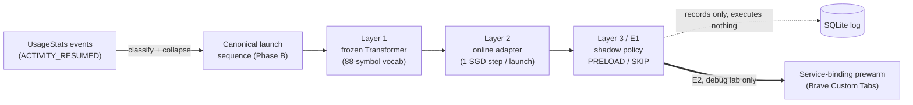

# AdaPreload

**On-device next-app prediction + an unprivileged app-prewarming mechanism for stock Android.**

AdaPreload is a single Android research prototype (`com.adapreload.instrumentation`) that predicts
the next app you are about to open, entirely on the phone, and then demonstrates and *measures* a
concrete way an ordinary app can make that launch faster — **without root or any special platform
privilege** — by binding a target app's exported Custom Tabs connection service to pre-create its
process ahead of time.

The project is deliberately staged and conservative: prediction, the preload **decision**, and
preload **execution** are three separate things, and the headline mechanism is described precisely as
**service-binding process prewarming via a public Custom Tabs contract — not OS-level preloading.**

> **Status:** research prototype / coursework artifact. Not a shipping product. All device numbers are
> bounded to the configuration they were measured on (see [Scope & limitations](#scope--limitations)).

<p>
  
  
  
  
  
</p>

---

## How it works



| Stage | What it is | Side effects |
|---|---|---|
| **Trace (Phase B)** | Reads `UsageStats` launch events, classifies them (supported / excluded / out-of-vocab), collapses repeats into a canonical sequence. | Read-only; persisted to SQLite. |
| **Layer 1** | A 2-layer Transformer encoder over an 88-symbol app vocabulary, exported **byte-for-byte** from an audited PyTorch checkpoint and run on-device with **verified numerical parity**. | None (pure inference). |
| **Layer 2** | A lightweight online adapter (`Linear 64→88`, SGD, lr 0.001) updated **one step per launch** in strict predict→reveal→update order (no leakage). | Updates only its own weights. |
| **Layer 3 / E1** | A conservative *shadow* policy that turns the top prediction into a **PRELOAD/SKIP decision and records it — it executes nothing.** | None; proven zero side effects. |
| **E2 (debug lab)** | The actual prewarm mechanism: bind an approved app's exported Custom Tabs service to pre-create its process, measured against cold launches. | Debug builds only; binds **one** approved target under manual control. |

---

## Results (bounded)

**Offline next-app prediction** — LSApp dataset, 59 held-out cold-start users / 30,040 events, 88-way task:

| Model | Macro Hit@1 | Macro Hit@5 | Micro Hit@1 |
|---|---|---|---|
| Order-1 Markov | 0.385 | 0.750 | 0.415 |
| Frozen Layer 1 | 0.458 | 0.778 | 0.501 |
| Personalized Layer 2 | **0.466** | **0.798** | **0.514** |

Online personalization gives a small but statistically significant preload-coverage gain at every
capacity *K* (peak **+0.0205 macro coverage at K=5**, 95% CI [+0.014, +0.028], Holm-corrected).

**On-device prewarm latency (E2b)** — Motorola edge 50 fusion, Android 16, 90 balanced trials
(30 per condition), median `am start -W` **TotalTime**:

| Condition | Median | Δ vs cold | Launch state |
|---|---|---|---|
| Cold | 300.5 ms | — | COLD |
| Bind-only | 219.5 ms | **−27.0%** | WARM (30/30) |
| `warmup(0)` | 200.5 ms | **−33.3%** | WARM (30/30) |

The OS reclassified **every** prewarmed launch from COLD to WARM. A bounded robustness check under
moderate multi-app memory pressure found the prewarmed process survived and launched WARM in all
three cycles.

**On-device prediction case study** — one user, 41 launches, 5 windows. L1 = L2 Hit@1 = **0.650**
(40 points), with Layer 2 changing Layer 1's top-1 on **0/40** transitions. This is a single-user
case study, **not** a statistically significant personalization claim.

**E2a service audit** — of **703** declared services on the device, **101** are technically bindable;
a separate manual safety review classified those 101 as **74 EXCLUDE / 25 REVIEW_REQUIRED / 2
recommended**, of which exactly **1** (Brave's Custom Tabs connection service) was used. *101
technically-bindable services are not 101 safe preload targets.*

---

## Build & run

Requirements: JDK 11+, Android SDK (compileSdk 37). The Gradle wrapper pins Gradle 9.6.0.

```bash
# Build the debug app (includes the research/prewarm lab)
./gradlew :app:assembleDebug

# Run the JVM unit tests (model parity, trace pipeline, Layer 2, E1 policy)
./gradlew :app:testDebugUnitTest

# Lint
./gradlew :app:lintDebug

# Release build (research lab is excluded from release)
./gradlew :app:assembleRelease
```

Install and grant **Usage Access** (required for launch observation), then start the foreground
service from the app's main screen. The UI shows a live trace card: recent canonical launches, the
next-app prediction, and the shadow preload decision (marked "not executed").

### Debug-only research triggers (`src/debug`, never in release)

```bash
# E2b prewarm lab — bind / unbind the one approved target (Brave) with an exact delay
adb shell am broadcast -n com.adapreload.instrumentation/.prewarm.PrewarmLabReceiver \
    -a com.adapreload.instrumentation.PREWARM_BIND --es mode bind_only
adb shell am broadcast -n com.adapreload.instrumentation/.prewarm.PrewarmLabReceiver \
    -a com.adapreload.instrumentation.PREWARM_UNBIND

# Export the on-device dry-run evaluation (recorded layer2_log + shadow_decisions, read-only)
adb shell am broadcast -n com.adapreload.instrumentation/.eval.DryRunReceiver \
    -a com.adapreload.instrumentation.DRYRUN_EXPORT
# -> /sdcard/Android/data/com.adapreload.instrumentation/files/dryrun_eval_<timestamp>.txt
```

---

## Repository layout

```
app/src/main/java/com/adapreload/instrumentation/
├── trace/        # Phase B: UsageStats → canonical launch sequence (classify, collapse, window)
├── collect/      # SQLite persistence + the foreground-service runtime wiring
├── model/        # Layer 1 (frozen Transformer) + Layer 2 (online adapter) inference cores
├── live/         # Layer 2 live personalization over the trace, committed atomically per batch
├── shadow/       # Layer 3 / E1 shadow preload policy (decisions only)
├── inventory/    # E2a read-only service-warmability inventory
├── service/      # foreground service
├── permission/   # Usage Access / notification setup
└── ui/           # Jetpack Compose screens
app/src/debug/    # research-only: prewarm lab + dry-run evaluator (excluded from release)
app/src/main/assets/
├── layer1/       # byte-exact exported backbone (manifest + weights)
├── lsapp_vocabulary.json
└── package_mapping.tsv
tools/            # export_layer1.py, audit_vocabulary.py, make_layer2_golden.py
docs/             # per-phase design specs (trace, Layer 1/2, E1, E2a)
```

### Documentation

| Doc | Topic |
|---|---|
| [`docs/ANDROID_TRACE_SPEC.md`](docs/ANDROID_TRACE_SPEC.md) | The trace pipeline and canonical-sequence rules |
| [`docs/LAYER1_ANDROID_INFERENCE.md`](docs/LAYER1_ANDROID_INFERENCE.md) | Layer 1 export + on-device parity |
| [`docs/LAYER2_ANDROID_ADAPTER.md`](docs/LAYER2_ANDROID_ADAPTER.md) | Layer 2 adapter core |
| [`docs/LAYER2_LIVE_INTEGRATION.md`](docs/LAYER2_LIVE_INTEGRATION.md) | Live Layer 2 over the trace |
| [`docs/PHASE_E1_SHADOW_PRELOAD.md`](docs/PHASE_E1_SHADOW_PRELOAD.md) | The shadow preload-decision policy |
| [`docs/PHASE_E2A_SERVICE_INVENTORY.md`](docs/PHASE_E2A_SERVICE_INVENTORY.md) | Service-warmability inventory + safety audit |

---

## Scope & limitations

- **Single device, single target.** The latency results are on one Motorola edge 50 fusion (Android 16)
  and one target app (Brave). No device claim generalizes beyond this configuration.
- **On-device prediction is a case study.** The 41-launch, single-user on-device run is illustrative,
  not statistically significant; the quantified personalization gain is **offline** (LSApp).
- **Moderate pressure only.** The severe-memory-pressure reclamation boundary was not reached; survival
  under severe pressure is not claimed.
- **Three effects kept separate** throughout: process pre-creation, COLD→WARM launch-state conversion,
  and launch-latency reduction.
- Offline probabilities are **uncalibrated**, and the Layer 2 learning rate and capacity *K* were
  selected on the evaluation cohort (exploratory, disclosed).

## Privacy & safety

AdaPreload reads only `UsageStats` (launch metadata the user explicitly grants via Usage Access) and
keeps everything on-device. The shadow policy records decisions and **executes nothing**; the prewarm
mechanism exists only in debug builds, uses only public APIs (no root), and binds a single
safety-audited target under manual control.

## License

No license has been chosen yet. Until a `LICENSE` file is added, all rights are reserved by the
author; open an issue if you would like to use the code.
